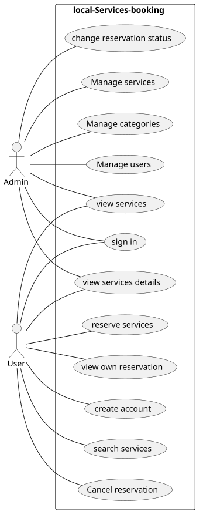
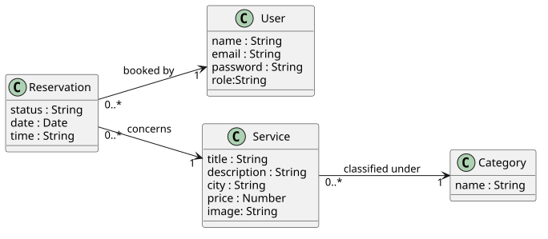
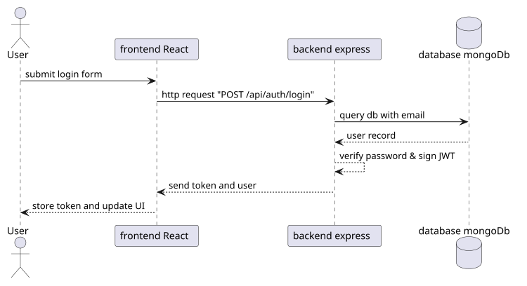

# Local Services Booking Platform

A full-stack MERN application for discovering, filtering, and booking local services, with a dedicated administration dashboard.

## Tech Stack
- **Frontend:** React 19, Vite, React Router, Axios
- **Backend:** Node.js, Express 5, JWT, bcrypt, express-validator
- **Database:** MongoDB & Mongoose
- **DevOps & CI:** Docker, Docker Compose, GitHub Actions, Jest / Supertest

---

## Features
- **User:** Account creation, JWT login, browse & filter services, book reservations, cancel own reservations.
- **Admin:** Manage categories, manage services, manage users, update reservation statuses.

---

## Project Structure
```text
├── client/          # React frontend (Vite)
├── server/          # Express REST API & Mongoose models
├── uml/             # UML diagrams (Use Case, Class, Sequence)
└── compose.yaml     # Multi-container Docker configuration
```

---

## Getting Started

### Prerequisites
- Node.js >= 20
- MongoDB instance (local or Atlas)
- Docker & Docker Compose (optional)

### 1. Manual Setup

**Backend:**
```bash
cd server
npm install
npm run dev
```

**Frontend:**
```bash
cd client
npm install
npm run dev
```

### 2. Docker Compose
Run the entire stack (MongoDB, Backend, Frontend) with one command:
```bash
docker compose up --build
```
- Client runs on: `http://localhost:8080`
- Server API runs on: `http://localhost:5000`

---

## Environment Variables

Create a `.env` file in the `server/` directory:
```env
PORT=5000
MONGO_URI=mongodb://localhost:27017/local_services
JWT_SECRET=your_jwt_secret_key
```

---

## Testing

Run backend integration and unit tests:
```bash
cd server
npm test
```

---

## UML Architecture

The diagrams below describe the actors, data relationships, and login flow. Editable PlantUML sources are stored in `uml/`; SVG exports are stored in `output/uml/`.

### Use-Case Diagram



[Editable PlantUML source](uml/use-cases.puml)

### Class Diagram



[Editable PlantUML source](uml/class-diagram.puml)

### Sequence Diagram: Login



[Editable PlantUML source](uml/sequence-diagram.puml)

---

## Deployments

- **Frontend:** [Live application on Vercel](https://local-services-booking.vercel.app/)
- **Backend:** [REST API on Render](https://local-services-booking-backend.onrender.com/api/services)

The frontend forwards `/api/*` requests to the Render backend through the rewrites in [`client/vercel.json`](client/vercel.json).
